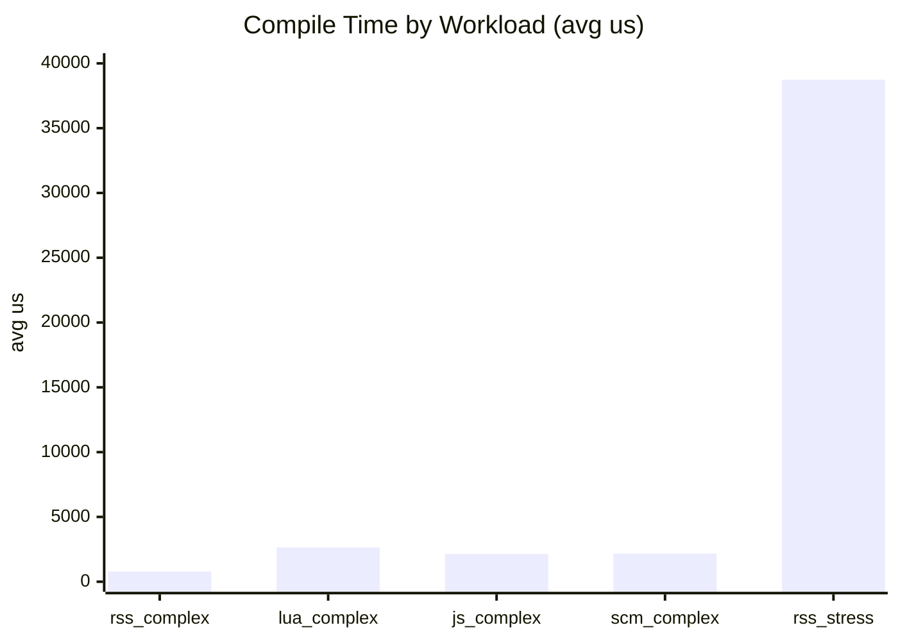
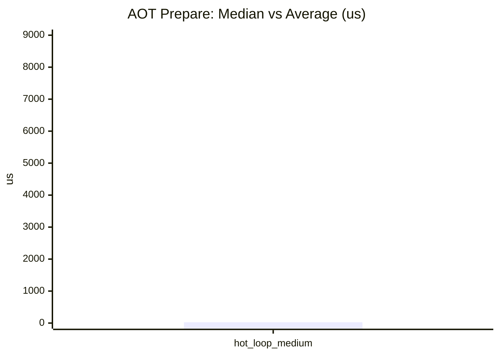
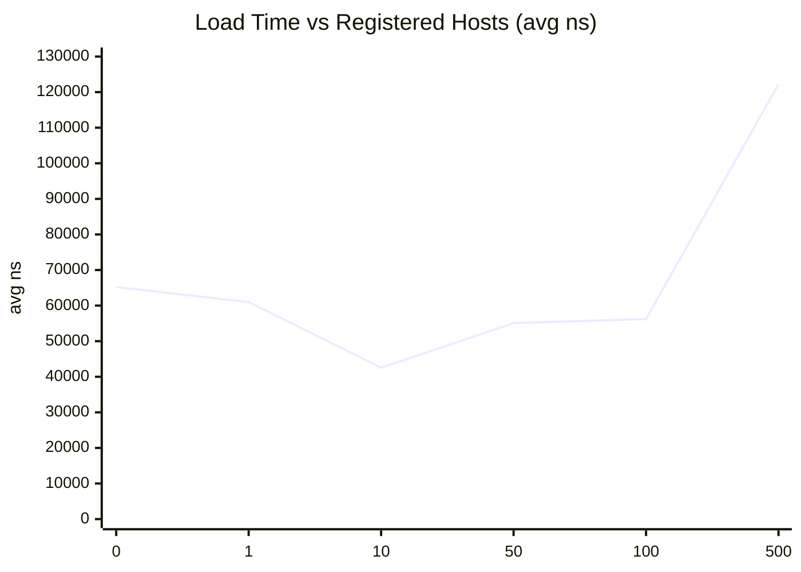
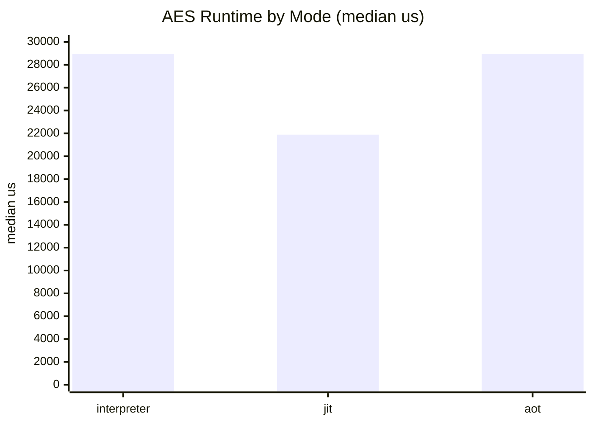
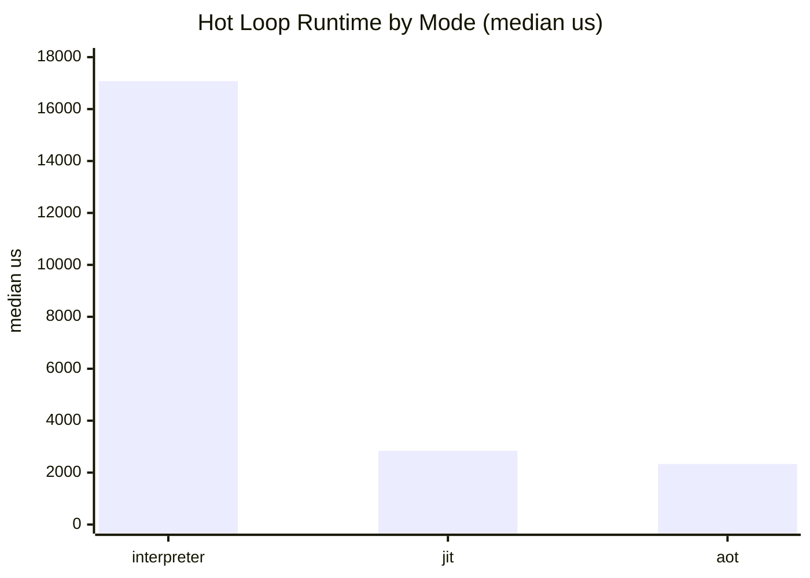
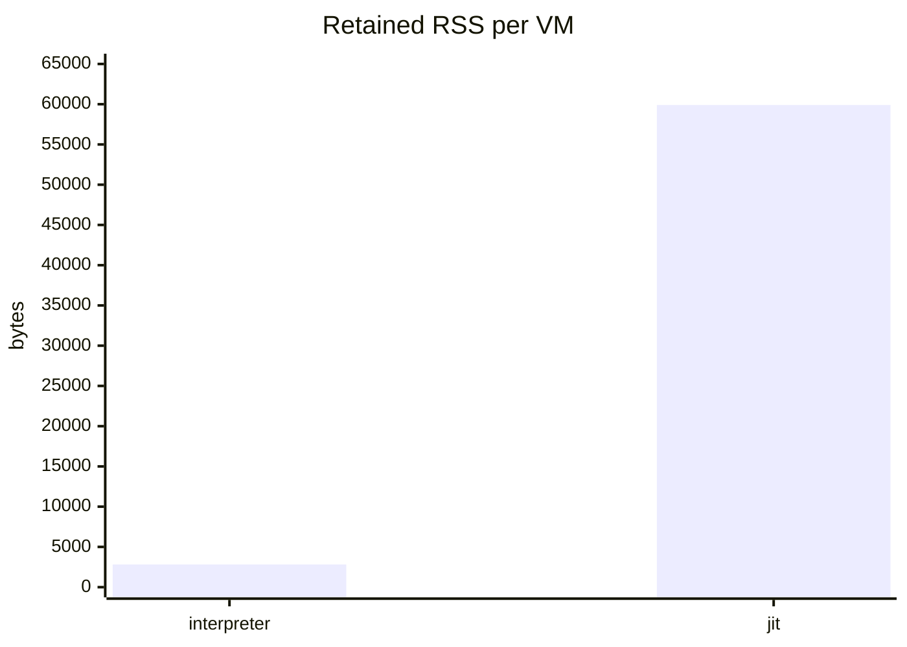

# Mini Bench Report (2026-03-09)

This record captures one `mini_bench` run after switching the `aot_compile` section to a lighter medium hot-loop workload.

Environment:

- Host: Windows x86_64 (local dev machine)
- Crate: `pd-vm`
- Profile: `--release`
- Native JIT support: `true`

Command:

```powershell
cargo run -p pd-vm --example mini_bench --release -- --compile-iters 5 --load-iters 200 --run-trials 3 --rss-vms 16 --aot-iters 3 --hot-loop-inner 10000 --hot-loop-outer 4
```

Raw result:

```text
pd-vm mini benchmark platform
config: compile_iters=5 compile_stress_lines=1000 load_iters=200 load_locals=4096 run_trials=3 rss_vms=16 hot_loop_inner=10000 hot_loop_outer=4 aot_iters=3 native_jit_supported=true

[compile]
  rss_complex_inline   total_ms=3        avg_us=784        locals=37 imports=0 constants=114 code_bytes=2420
  lua_complex_file     total_ms=13       avg_us=2639       locals=133 imports=2 constants=348 code_bytes=3878
  js_complex_file      total_ms=10       avg_us=2142       locals=112 imports=2 constants=192 code_bytes=2944
  scm_complex_file     total_ms=10       avg_us=2171       locals=117 imports=2 constants=301 code_bytes=3105
  rss_stress_inline    total_ms=193      avg_us=38739      locals=2 imports=0 constants=2002 code_bytes=33081

[aot_compile]
  hot_loop_medium median_us=25 avg_us=8509 prepared_traces_median=7

[load]
  hosts=0    total_ms=13       avg_ns=65208        imports=0 locals=4096
  hosts=1    total_ms=12       avg_ns=60993        imports=1 locals=4096
  hosts=10   total_ms=8        avg_ns=42532        imports=10 locals=4096
  hosts=50   total_ms=11       avg_ns=55078        imports=50 locals=4096
  hosts=100  total_ms=11       avg_ns=56227        imports=100 locals=4096
  hosts=500  total_ms=24       avg_ns=122208       imports=500 locals=4096

[run]
  aes_128_cbc_usage mode=interpreter  median_us=28926      avg_us=28434
  aes_128_cbc_usage mode=jit          median_us=21881      avg_us=22532
  aes_128_cbc_usage mode=aot          median_us=28946      avg_us=28444
  hot_loop         mode=interpreter  median_us=17077      avg_us=17200
  hot_loop         mode=jit          median_us=2840       avg_us=3073
  hot_loop         mode=aot          median_us=2331       avg_us=3095

[rss]
  mode=interpreter  retained_vms=16     before=7950336B after=7995392B avg_per_vm=2816B (2.75 KiB)
  mode=jit          retained_vms=16     before=7979008B after=8937472B avg_per_vm=59904B (58.50 KiB)
```

## Summary

- The large inline RSS compiler stress case is the dominant compile-time cost at `38,739 us` per compile.
- AES runtime improved in JIT mode versus interpreter, but this run showed no AOT win on AES.
- The hot loop shows the expected native payoff: JIT is about `6.0x` faster than interpreter and AOT is about `7.3x` faster.
- Retained RSS per VM stays low in interpreter mode in this sample, while JIT retention adds about `58.50 KiB` per VM.
- Load-time measurements are small enough that some low-host-count points are noisy; the clear signal is the jump at `500` registered hosts.

## Compile

| Workload | Avg Compile Time | Locals | Imports | Constants | Code Bytes |
|---|---:|---:|---:|---:|---:|
| `rss_complex_inline` | 784 us | 37 | 0 | 114 | 2420 |
| `lua_complex_file` | 2639 us | 133 | 2 | 348 | 3878 |
| `js_complex_file` | 2142 us | 112 | 2 | 192 | 2944 |
| `scm_complex_file` | 2171 us | 117 | 2 | 301 | 3105 |
| `rss_stress_inline` | 38739 us | 2 | 0 | 2002 | 33081 |



## AOT Compile

| Workload | Median Prepare Time | Avg Prepare Time | Median Prepared Traces |
|---|---:|---:|---:|
| `hot_loop_medium` | 25 us | 8509 us | 7 |



The `avg us` is much higher than the `median us`, which suggests one expensive setup outlier during the three samples. For this section, the median is the more representative steady value.

## Load

This benchmark measures VM creation while reusing a compiled `Program`, inflating the VM to `4096` locals, and varying the number of registered/bound host functions.

| Registered Hosts | Avg Load Time |
|---|---:|
| 0 | 65208 ns |
| 1 | 60993 ns |
| 10 | 42532 ns |
| 50 | 55078 ns |
| 100 | 56227 ns |
| 500 | 122208 ns |



At low counts this is mostly timer noise plus allocator/cache effects. The stable signal is that binding cost is still small through `100` hosts and then rises more noticeably at `500`.

## Run

### AES workload

| Mode | Median Runtime | Avg Runtime | Relative to Interpreter |
|---|---:|---:|---:|
| Interpreter | 28926 us | 28434 us | 1.00x |
| JIT | 21881 us | 22532 us | 1.32x faster |
| AOT | 28946 us | 28444 us | 1.00x |



### Hot loop workload

| Mode | Median Runtime | Avg Runtime | Relative to Interpreter |
|---|---:|---:|---:|
| Interpreter | 17077 us | 17200 us | 1.00x |
| JIT | 2840 us | 3073 us | 6.01x faster |
| AOT | 2331 us | 3095 us | 7.33x faster |



The runtime section excludes JIT warmup and AOT compile from the timed phase. Each measured sample warms the VM first, resets it, and only then times the second execution.

## RSS

This benchmark creates and retains `16` VMs, then computes average retained RSS growth per VM.

| Mode | Avg Retained RSS per VM |
|---|---:|
| Interpreter | 2816 B |
| JIT | 59904 B |



## Takeaways

- The compile benchmark already separates normal frontend compile cost from a deliberately large RSS stress case, and the stress case dominates by a wide margin.
- The new lighter `aot_compile` section is now cheap enough to keep in the mini benchmark while still exercising `prepare_aot()`.
- Native execution gives a clear win on hot loops, but AES in this sample was effectively parity between interpreter and AOT while JIT was faster.
- JIT memory retention is measurable and should remain part of perf tracking when native trace behavior changes.
