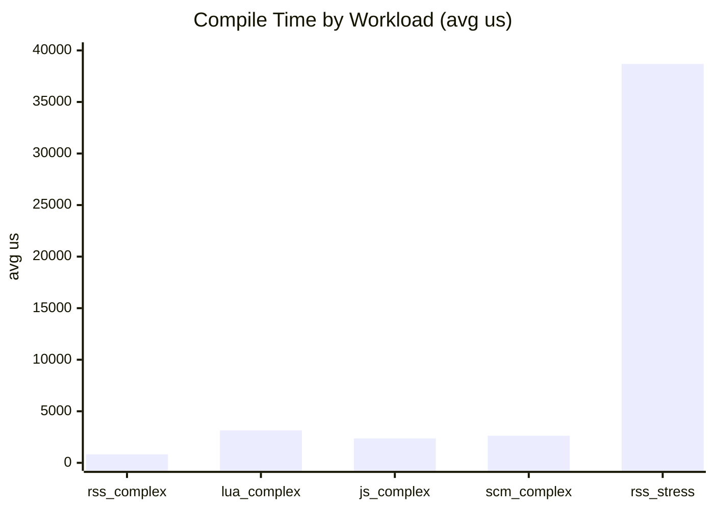
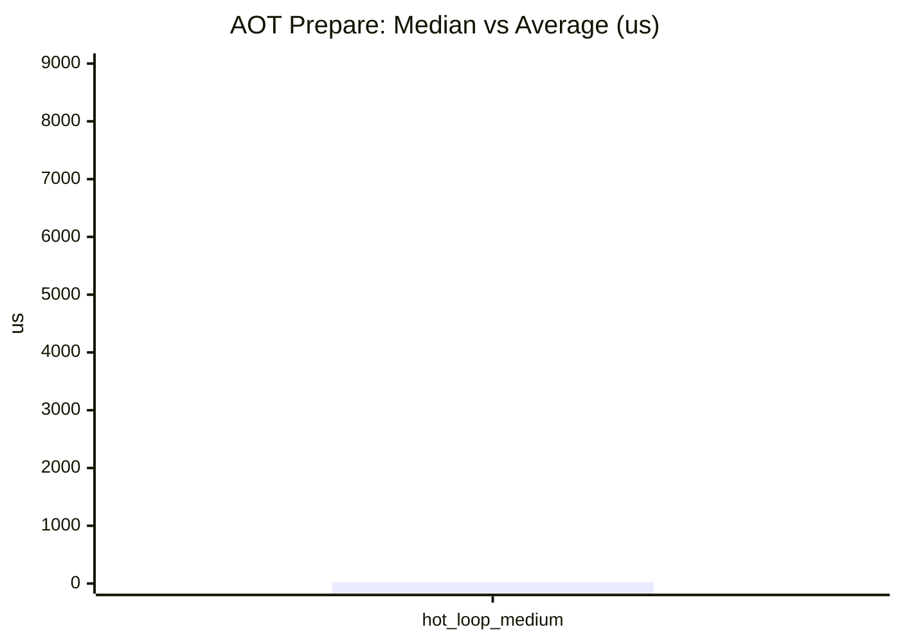
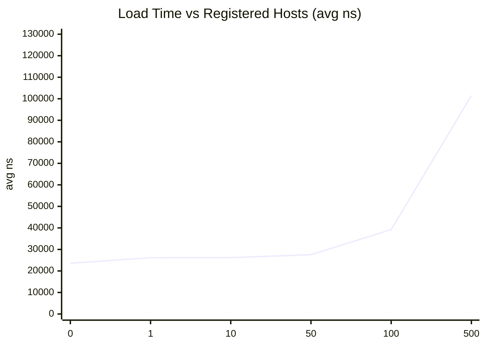
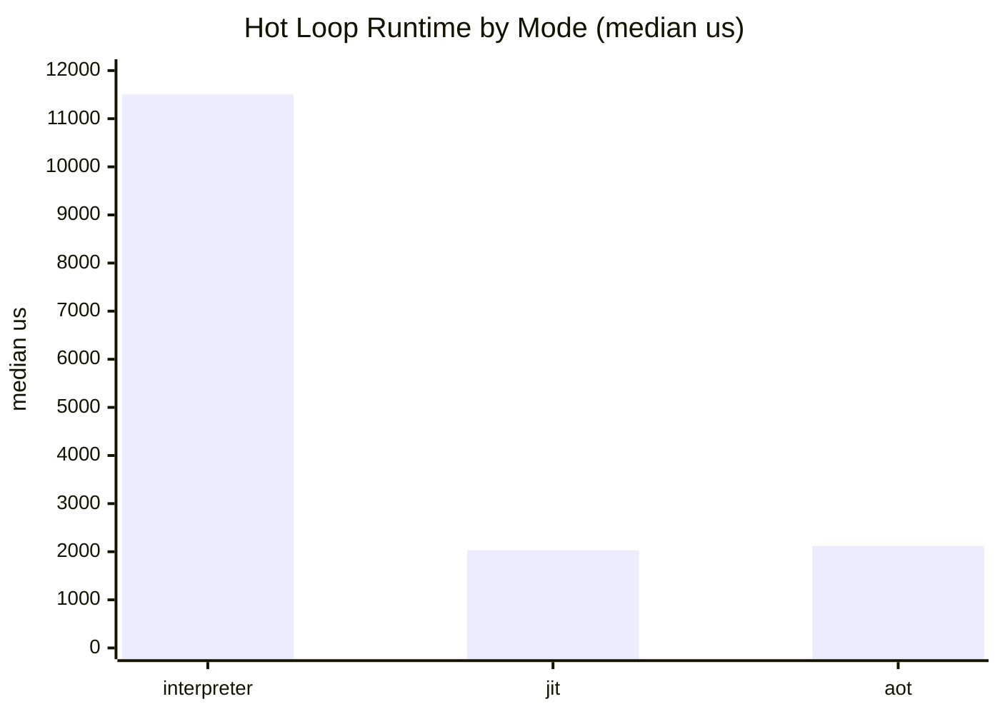
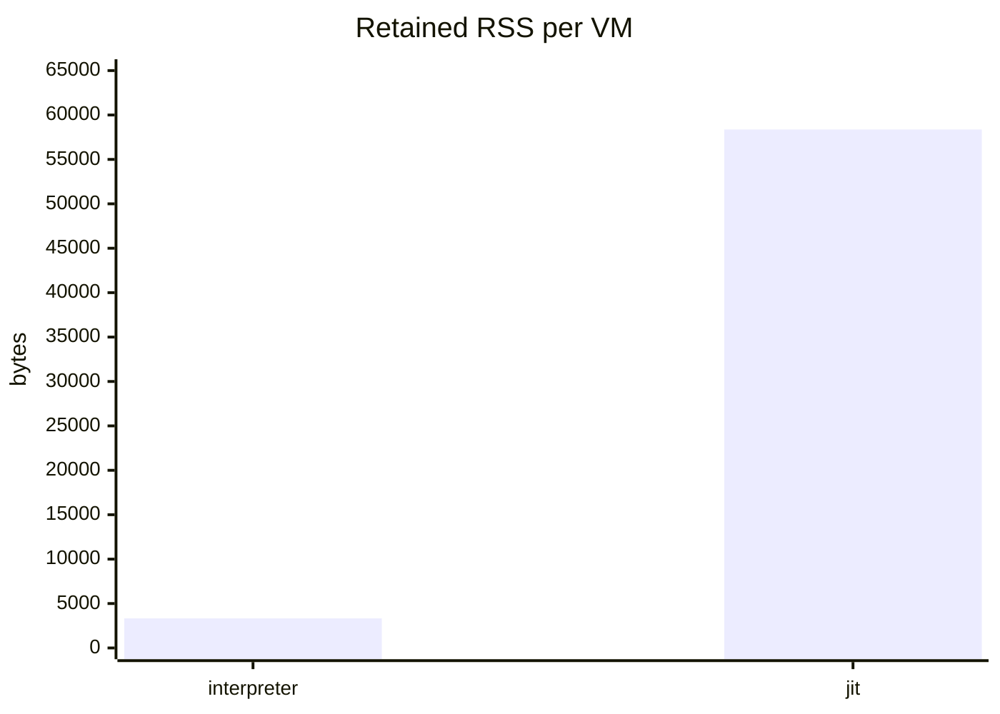

# Mini Bench Report (2026-03-10)

This record captures a rerun of the same reduced `mini_bench` command used in the 2026-03-09 report, with one temporary harness adjustment: the AES runtime fixture is skipped if it fails to compile so the benchmark can still produce hot-loop runtime and RSS data.

Status:

- `compile`, `aot_compile`, `load`, `run`, and `rss` all completed.
- The AES runtime fixture is still broken at `HEAD`, so the runtime section is partial.
- The run data below includes hot-loop results only; AES is reported as skipped with its compile error.

Environment:

- Host: Windows x86_64 (local dev machine)
- Crate: `pd-vm`
- Profile: `--release`
- Native JIT support: `true`
- Commit: `147cf89a68e507da3e1c4599fa295fe0bdbf9d69`

Command:

```powershell
cargo run -p pd-vm --example mini_bench --release -- --compile-iters 5 --load-iters 200 --run-trials 3 --rss-vms 16 --aot-iters 3 --hot-loop-inner 10000 --hot-loop-outer 4
```

Raw result:

```text
pd-vm mini benchmark platform
config: compile_iters=5 compile_stress_lines=1000 load_iters=200 load_locals=4096 run_trials=3 rss_vms=16 hot_loop_inner=10000 hot_loop_outer=4 aot_iters=3 native_jit_supported=true

[compile]
  rss_complex_inline   total_ms=4        avg_us=824        locals=37 imports=0 constants=114 code_bytes=2420
  lua_complex_file     total_ms=15       avg_us=3146       locals=135 imports=2 constants=352 code_bytes=3901
  js_complex_file      total_ms=11       avg_us=2367       locals=114 imports=2 constants=194 code_bytes=2953
  scm_complex_file     total_ms=13       avg_us=2632       locals=119 imports=2 constants=305 code_bytes=3128
  rss_stress_inline    total_ms=193      avg_us=38687      locals=2 imports=0 constants=2002 code_bytes=33081

[aot_compile]
  hot_loop_medium median_us=24 avg_us=7972 prepared_traces_median=7

[load]
  hosts=0    total_ms=4        avg_ns=23583        imports=0 locals=4096
  hosts=1    total_ms=5        avg_ns=26147        imports=1 locals=4096
  hosts=10   total_ms=5        avg_ns=26168        imports=10 locals=4096
  hosts=50   total_ms=5        avg_ns=27556        imports=50 locals=4096
  hosts=100  total_ms=7        avg_ns=39216        imports=100 locals=4096
  hosts=500  total_ms=20       avg_ns=101474       imports=500 locals=4096

[run]
  aes_128_cbc_usage mode=all          skipped compile_error=compile error: cannot infer '+' operand types in function body: int vs unknown
  hot_loop         mode=interpreter  median_us=11505      avg_us=11593
  hot_loop         mode=jit          median_us=2029       avg_us=1991
  hot_loop         mode=aot          median_us=2119       avg_us=2125

[rss]
  mode=interpreter  retained_vms=16     before=8671232B after=8724480B avg_per_vm=3328B (3.25 KiB)
  mode=jit          retained_vms=16     before=8704000B after=9637888B avg_per_vm=58368B (57.00 KiB)
```

## Summary

- The benchmark is usable again for compile, AOT, load, hot-loop runtime, and RSS tracking.
- The temporary skip kept the still-broken AES fixture from aborting the entire run.
- Compile times regressed noticeably for the Lua, JavaScript, and Scheme complex fixtures versus 2026-03-09.
- Hot-loop runtime improved in all three modes, but AOT no longer leads JIT in this sample.

## Regression Callout

### Remaining functional regression

The AES runtime fixture still does not compile:

```text
compile error: cannot infer '+' operand types in function body: int vs unknown
```

So this report is only partially comparable to 2026-03-09:

- AES runtime was present on 2026-03-09 and is skipped on 2026-03-10.
- Hot-loop runtime and RSS are still comparable.

### Measurable regressions from completed sections

- `lua_complex_file` compile time regressed by about `19.2%`.
- `js_complex_file` compile time regressed by about `10.5%`.
- `scm_complex_file` compile time regressed by about `21.2%`.
- Interpreter RSS retention regressed from `2.75 KiB` to `3.25 KiB` per VM.
- AOT lost its March 9 lead over JIT on the hot loop: JIT is slightly faster in this sample.

## Compile

| Workload | Avg Compile Time | 2026-03-09 | Change | Locals | Imports | Constants | Code Bytes |
|---|---:|---:|---:|---:|---:|---:|---:|
| `rss_complex_inline` | 824 us | 784 us | `+5.1%` | 37 | 0 | 114 | 2420 |
| `lua_complex_file` | 3146 us | 2639 us | `+19.2%` regression | 135 | 2 | 352 | 3901 |
| `js_complex_file` | 2367 us | 2142 us | `+10.5%` regression | 114 | 2 | 194 | 2953 |
| `scm_complex_file` | 2632 us | 2171 us | `+21.2%` regression | 119 | 2 | 305 | 3128 |
| `rss_stress_inline` | 38687 us | 38739 us | `-0.1%` | 2 | 0 | 2002 | 33081 |



The language-fixture compile regressions line up with slightly larger generated programs than March 9:

- Lua: `133 -> 135` locals, `348 -> 352` constants, `3878 -> 3901` code bytes
- JS: `112 -> 114` locals, `192 -> 194` constants, `2944 -> 2953` code bytes
- Scheme: `117 -> 119` locals, `301 -> 305` constants, `3105 -> 3128` code bytes

## AOT Compile

| Workload | Median Prepare Time | Avg Prepare Time | 2026-03-09 Median | 2026-03-09 Avg | Median Prepared Traces |
|---|---:|---:|---:|---:|---:|
| `hot_loop_medium` | 24 us | 7972 us | 25 us | 8509 us | 7 |



This section improved slightly versus March 9. The median is effectively flat, the average is lower, and the prepared trace count is unchanged.

## Load

This benchmark measures VM creation while reusing a compiled `Program`, inflating the VM to `4096` locals, and varying the number of registered/bound host functions.

| Registered Hosts | Avg Load Time | 2026-03-09 | Change |
|---|---:|---:|---:|
| 0 | 23583 ns | 65208 ns | `-63.8%` |
| 1 | 26147 ns | 60993 ns | `-57.1%` |
| 10 | 26168 ns | 42532 ns | `-38.5%` |
| 50 | 27556 ns | 55078 ns | `-50.0%` |
| 100 | 39216 ns | 56227 ns | `-30.3%` |
| 500 | 101474 ns | 122208 ns | `-17.0%` |



Load improved materially across the board in this sample. The `500`-host point improved enough that this likely reflects a real change, not just timer noise.

## Run

### AES workload

This workload was skipped temporarily in the benchmark harness because it currently fails to compile.

| Workload | Status |
|---|---|
| `aes_128_cbc_usage` | skipped due to compile error |

### Hot loop workload

| Mode | Median Runtime | Avg Runtime | Relative to Interpreter |
|---|---:|---:|---:|
| Interpreter | 11505 us | 11593 us | 1.00x |
| JIT | 2029 us | 1991 us | 5.67x faster |
| AOT | 2119 us | 2125 us | 5.43x faster |



Compared with March 9:

- Interpreter improved from `17077 us` to `11505 us`
- JIT improved from `2840 us` to `2029 us`
- AOT improved from `2331 us` to `2119 us`

The main change in shape is that JIT edged out AOT in this sample instead of trailing it.

## RSS

This benchmark creates and retains `16` VMs, then computes average retained RSS growth per VM.

| Mode | Avg Retained RSS per VM | 2026-03-09 | Change |
|---|---:|---:|---:|
| Interpreter | 3328 B | 2816 B | `+18.2%` regression |
| JIT | 58368 B | 59904 B | `-2.6%` |



Interpreter retention regressed modestly, while JIT retention improved slightly and stayed in the same overall range as March 9.

## Takeaways

- The mini benchmark is usable again for most perf tracking, but AES remains a real functional regression.
- The most important measurable regressions in this run are compile-time regressions for the Lua, JavaScript, and Scheme complex fixtures.
- Load times and hot-loop runtime improved substantially.
- AOT compile stayed healthy, but AOT runtime no longer beat JIT on the hot loop in this sample.
