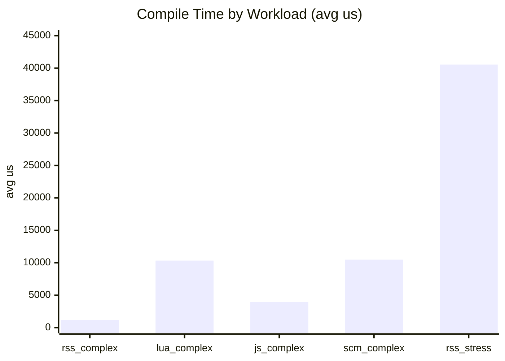
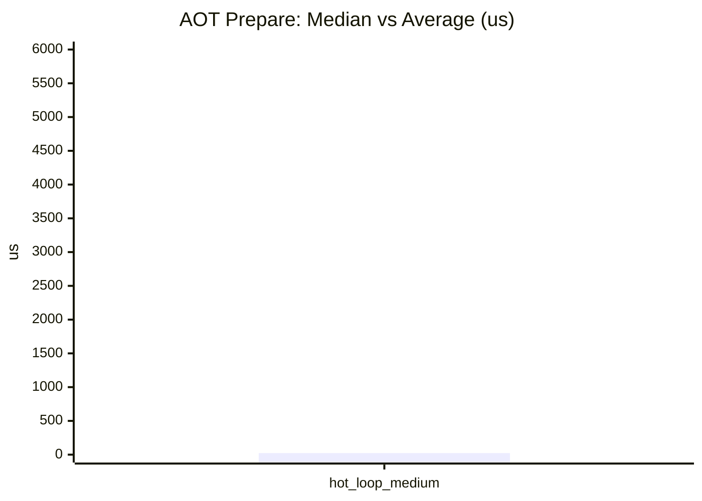
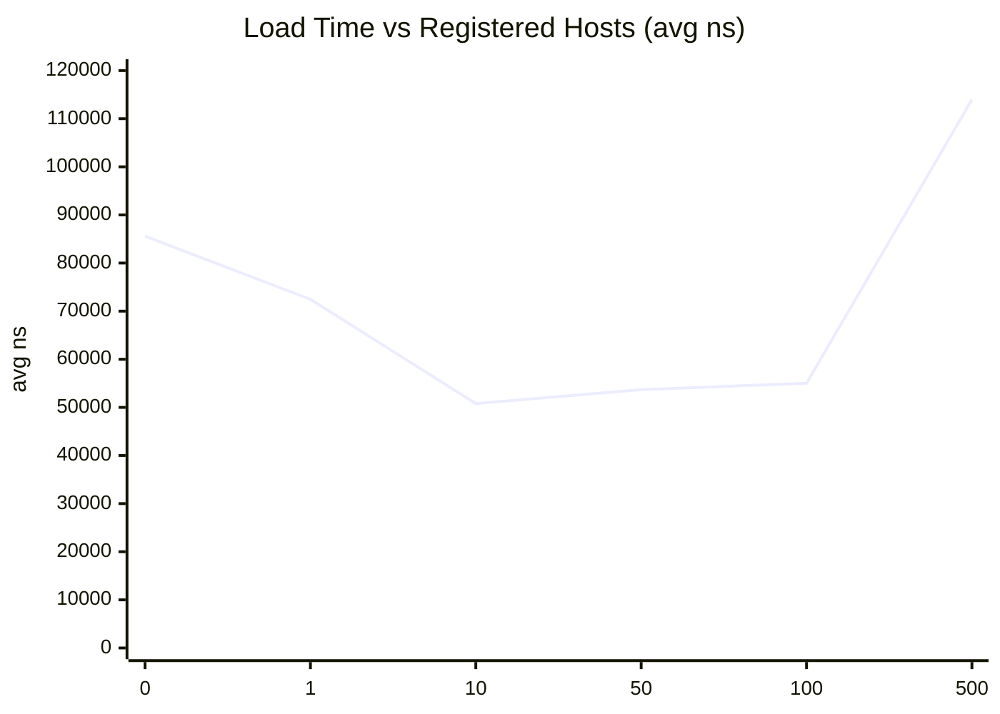
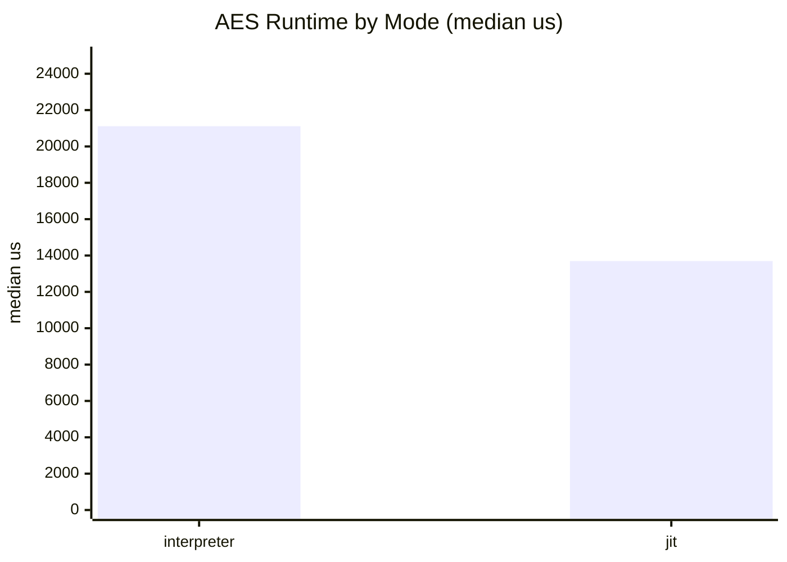
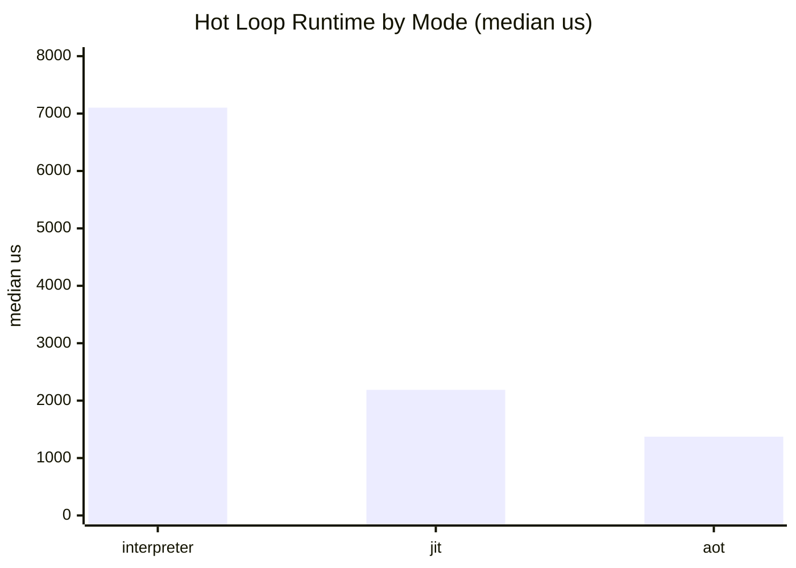
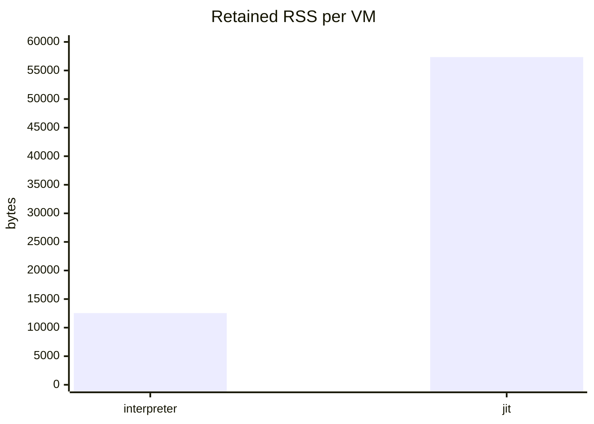

# Mini Bench Report (2026-03-11)

This record captures a rerun of the same reduced `mini_bench` command used in the 2026-03-10 report. Two benchmark-framework adjustments were needed at `HEAD`: the inline RustScript compile fixture was updated to declare schemas for optional chaining, and AES AOT is skipped because it aborts the process on the current build.

Status:

- `compile`, `aot_compile`, `load`, `run`, and `rss` all completed.
- `aes_128_cbc_usage` completed in interpreter and JIT mode.
- `aes_128_cbc_usage` AOT is skipped with `known_aot_abort_on_current_head`.
- The timed run used the built `target/release/examples/mini_bench.exe` under a `600s` timeout wrapper.

Environment:

- Host: Windows x86_64 (local dev machine)
- Crate: `pd-vm`
- Profile: `--release`
- Native JIT support: `true`
- Commit: `0b288601f264d02898bb5f370e14e329bdfa72af`

Command:

```powershell
cargo run -p pd-vm --example mini_bench --release -- --compile-iters 5 --load-iters 200 --run-trials 3 --rss-vms 16 --aot-iters 3 --hot-loop-inner 10000 --hot-loop-outer 4
```

Raw result:

```text
pd-vm mini benchmark platform
config: compile_iters=5 compile_stress_lines=1000 load_iters=200 load_locals=4096 run_trials=3 rss_vms=16 hot_loop_inner=10000 hot_loop_outer=4 aot_iters=3 native_jit_supported=true

[compile]
  rss_complex_inline   total_ms=5        avg_us=1181       locals=32 imports=0 constants=106 code_bytes=2009
  lua_complex_file     total_ms=51       avg_us=10334      locals=135 imports=2 constants=489 code_bytes=4591
  js_complex_file      total_ms=19       avg_us=3977       locals=106 imports=2 constants=193 code_bytes=2549
  scm_complex_file     total_ms=52       avg_us=10475      locals=119 imports=2 constants=426 code_bytes=3783
  rss_stress_inline    total_ms=202      avg_us=40552      locals=2 imports=0 constants=2002 code_bytes=24066

[aot_compile]
  hot_loop_medium median_us=23 avg_us=5468 prepared_traces_median=7

[load]
  hosts=0    total_ms=17       avg_ns=85599        imports=0 locals=4096
  hosts=1    total_ms=14       avg_ns=72458        imports=1 locals=4096
  hosts=10   total_ms=10       avg_ns=50796        imports=10 locals=4096
  hosts=50   total_ms=10       avg_ns=53689        imports=50 locals=4096
  hosts=100  total_ms=11       avg_ns=55009        imports=100 locals=4096
  hosts=500  total_ms=22       avg_ns=113966       imports=500 locals=4096

[run]
  aes_128_cbc_usage mode=interpreter  median_us=21113      avg_us=21015
  aes_128_cbc_usage mode=jit          median_us=13696      avg_us=13705
  aes_128_cbc_usage mode=aot          skipped known_aot_abort_on_current_head
  hot_loop         mode=interpreter  median_us=7103       avg_us=7080
  hot_loop         mode=jit          median_us=2187       avg_us=2032
  hot_loop         mode=aot          median_us=1372       avg_us=1371

[rss]
  mode=interpreter  retained_vms=16     before=8921088B after=9121792B avg_per_vm=12544B (12.25 KiB)
  mode=jit          retained_vms=16     before=8949760B after=9867264B avg_per_vm=57344B (56.00 KiB)
```

## Summary

- The file-backed compile fixtures regressed sharply versus 2026-03-10, especially Lua and Scheme.
- `prepare_aot()` improved and hot-loop AOT is again the fastest runtime mode in this sample.
- AES interpreter and JIT improved materially, but AES AOT is still unusable at `HEAD`.
- VM load time and interpreter retained RSS both regressed noticeably.

## Comparability

- `rss_complex_inline` is not directly comparable to 2026-03-10 because the inline fixture was patched to satisfy the current RustScript optional-chain schema requirement.
- The AES runtime section is partial because AOT is skipped to keep the benchmark from aborting.

## Compile

| Workload | Avg Compile Time | 2026-03-10 | Change | Locals | Imports | Constants | Code Bytes |
|---|---:|---:|---:|---:|---:|---:|---:|
| `rss_complex_inline` | 1181 us | 824 us | `n/a (fixture updated)` | 32 | 0 | 106 | 2009 |
| `lua_complex_file` | 10334 us | 3146 us | `+228.5%` regression | 135 | 2 | 489 | 4591 |
| `js_complex_file` | 3977 us | 2367 us | `+68.0%` regression | 106 | 2 | 193 | 2549 |
| `scm_complex_file` | 10475 us | 2632 us | `+298.0%` regression | 119 | 2 | 426 | 3783 |
| `rss_stress_inline` | 40552 us | 38687 us | `+4.8%` regression | 2 | 0 | 2002 | 24066 |



The most meaningful compile regressions are in the shared language-file fixtures. The inline RustScript row should be treated as a fresh baseline because the benchmark input changed.

## AOT Compile

| Workload | Median Prepare Time | Avg Prepare Time | 2026-03-10 Median | 2026-03-10 Avg | Change |
|---|---:|---:|---:|---:|---:|
| `hot_loop_medium` | 23 us | 5468 us | 24 us | 7972 us | median `-4.2%`, avg `-31.4%` |



## Load

This benchmark measures VM creation while reusing a compiled `Program`, inflating the VM to `4096` locals, and varying the number of registered/bound host functions.

| Registered Hosts | Avg Load Time | 2026-03-10 | Change |
|---|---:|---:|---:|
| 0 | 85599 ns | 23583 ns | `+263.0%` regression |
| 1 | 72458 ns | 26147 ns | `+177.1%` regression |
| 10 | 50796 ns | 26168 ns | `+94.1%` regression |
| 50 | 53689 ns | 27556 ns | `+94.8%` regression |
| 100 | 55009 ns | 39216 ns | `+40.3%` regression |
| 500 | 113966 ns | 101474 ns | `+12.3%` regression |



## Run

### AES workload

| Mode | Median Runtime | 2026-03-10 | Change | Relative to Interpreter |
|---|---:|---:|---:|---:|
| Interpreter | 21113 us | 28926 us | `-27.0%` | 1.00x |
| JIT | 13696 us | 21881 us | `-37.4%` | 1.54x faster |
| AOT | skipped | 28946 us | `n/a` | `n/a` |



### Hot loop workload

| Mode | Median Runtime | 2026-03-10 | Change | Relative to Interpreter |
|---|---:|---:|---:|---:|
| Interpreter | 7103 us | 11505 us | `-38.3%` | 1.00x |
| JIT | 2187 us | 2029 us | `+7.8%` regression | 3.25x faster |
| AOT | 1372 us | 2119 us | `-35.3%` | 5.18x faster |



## RSS

This benchmark creates and retains `16` VMs, then computes average retained RSS growth per VM.

| Mode | Avg Retained RSS per VM | 2026-03-10 | Change |
|---|---:|---:|---:|
| Interpreter | 12544 B | 3328 B | `+276.9%` regression |
| JIT | 57344 B | 58368 B | `-1.8%` |



## Takeaways

- The benchmark is usable again at `HEAD`, but only with two explicit harness guardrails: schema-typed optional chaining in the inline RustScript fixture and an AES AOT skip.
- File compile cost, VM construction cost, and interpreter retained RSS all moved in the wrong direction in this sample.
- AES interpreter/JIT and hot-loop interpreter/AOT improved, but hot-loop JIT regressed slightly versus 2026-03-10.
- AOT remains the best-performing hot-loop mode in this rerun despite the AES AOT runtime bug.
