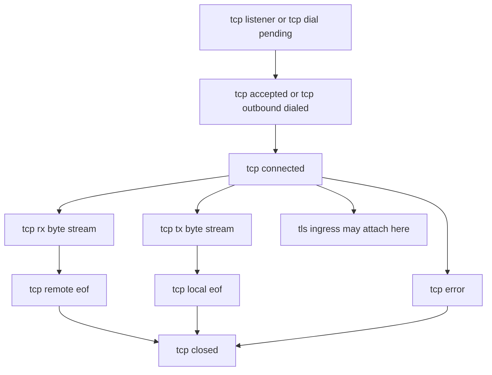
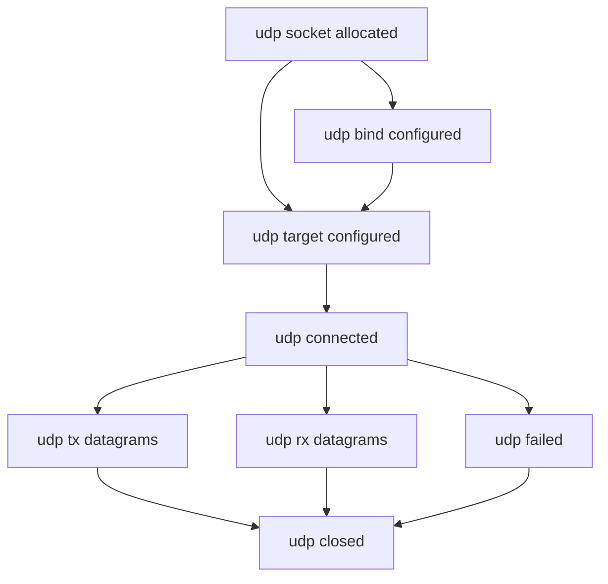
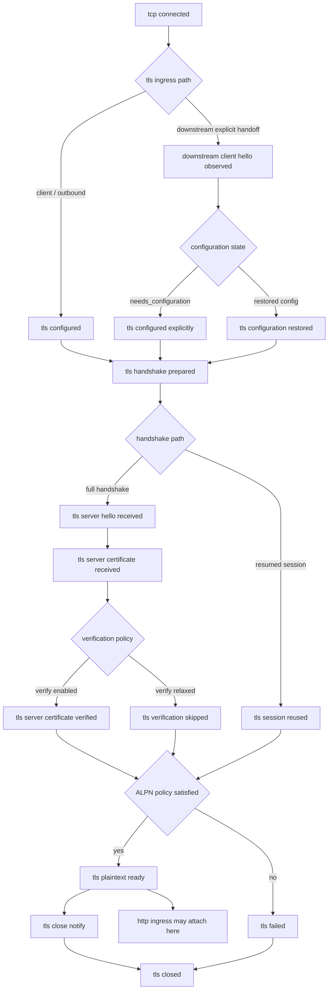
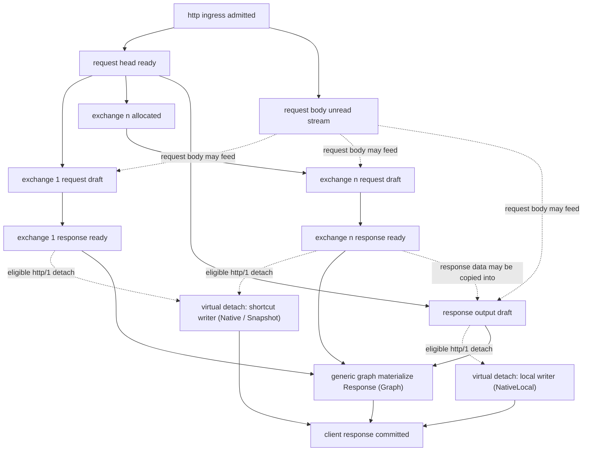
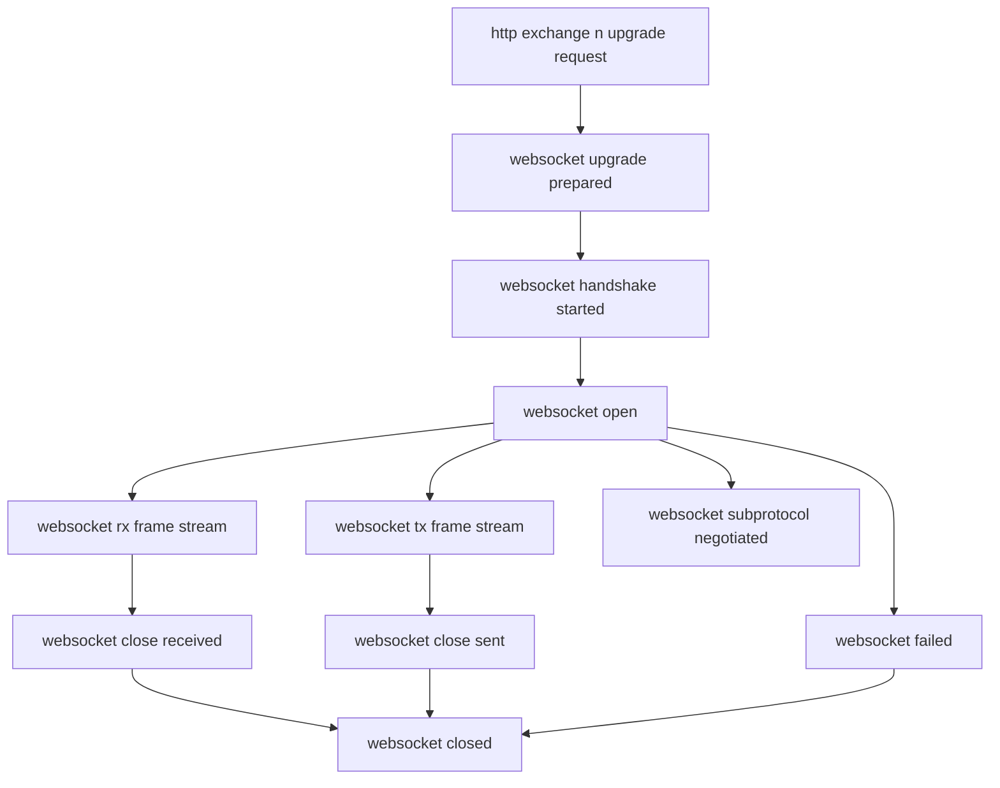
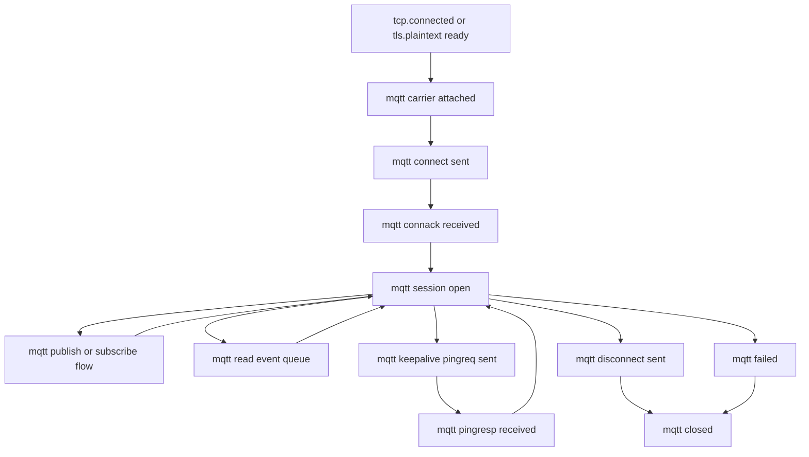
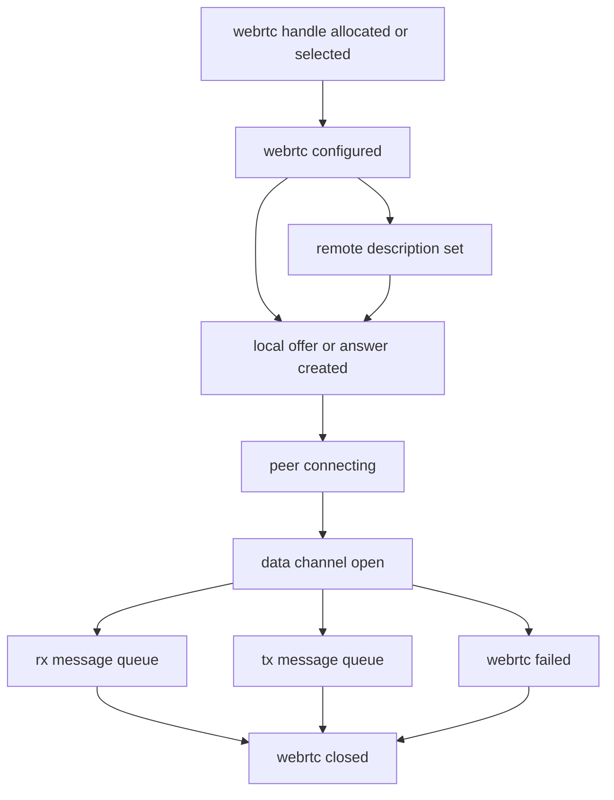
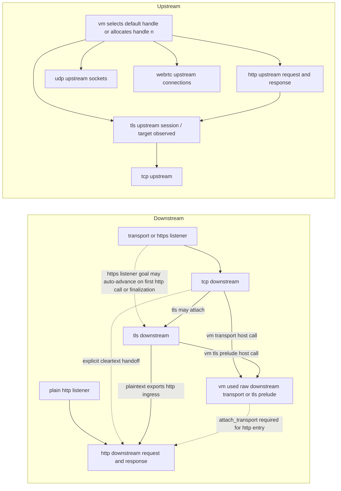

# pd-edge

[](https://crates.io/crates/pd-edge)

`pd-edge` is the edge data-plane runtime plus the edge ABI for running VM programs at the edge.

## Cargo usage

The workspace uses sibling RustScript crates during local development. For downstream Cargo manifests, use these repository references:

```toml
pd-vm = { git = "https://github.com/rustscript-lang/rustscript", package = "pd-vm" }
pd-edge-abi = { git = "https://github.com/rustscript-lang/pd-edge", package = "pd-edge-abi" }
pd-edge = { git = "https://github.com/rustscript-lang/pd-edge", package = "pd-edge" }
```

## Test

```bash
cargo test --workspace 
cargo build --workspace --release 
```

## Runtime guide

`pd-edge` is the edge runtime crate for running VM programs at the edge.

This crate now ships three binaries with different scopes:

- `pd-edge-http-proxy`: full HTTP data plane runtime (proxy path + admin API + optional active control-plane client)
- `pd-edge-console`: interactive local console runtime (stdin/stdout/stderr host APIs + optional active control-plane client)
- `pd-edge-sample-echo-server`: local multi-protocol echo server for manual transport and host-ABI testing

## Contents

- [Binary Scope](#binary-scope)
  - [pd-edge-http-proxy](#pd-edge-http-proxy)
  - [pd-edge-console](#pd-edge-console)
  - [pd-edge-sample-echo-server](#pd-edge-sample-echo-server)
- [Quick Start](#quick-start)
  - [HTTP Proxy Mode](#http-proxy-mode)
  - [Console Mode](#console-mode)
  - [Sample Echo Server](#sample-echo-server)
- [HTTP Proxy Admin API](#http-proxy-admin-api)
- [CLI](#cli)
  - [pd-edge-http-proxy](#pd-edge-http-proxy-1)
  - [pd-edge-console](#pd-edge-console-1)
  - [pd-edge-sample-echo-server](#pd-edge-sample-echo-server-1)
- [Active Control-Plane RPC](#active-control-plane-rpc)
  - [Example](#example)
- [HTTP Proxy Performance Framework](#http-proxy-performance-framework)
- [Layered DAGs](#layered-dags)
- [ABI Source of Truth](#abi-source-of-truth)
- [Release Artifacts](#release-artifacts)
- [Docker](#docker)
- [Codebase Layout](#codebase-layout)

## Binary Scope

### `pd-edge-http-proxy`

- Handles HTTP traffic on a data plane listener
- Exposes local admin APIs for program upload, health, metrics, telemetry, and debug session lifecycle
- Can run standalone (admin upload only) or with active control-plane RPC
- Registers HTTP host ABI + runtime host ABI + built-in IO overrides

Default listeners:

- Data plane: `0.0.0.0:8080`
- Admin API: `127.0.0.1:8081`

### `pd-edge-console`

- No HTTP proxy listeners
- Runs an interactive shell to load and execute VM programs locally
- Supports console host APIs: `console::stdin::read_line()`, `console::stdin::read_all()`, `console::stdout::write(text)`, `console::stdout::flush()`, `console::stderr::write(text)`, `console::stderr::flush()`
- Registers runtime host ABI (`runtime::sleep`, `rate_limit::allow`) plus the console host APIs above

### `pd-edge-sample-echo-server`

- Starts separate listeners for TCP, UDP, TLS, HTTP, HTTPS, WebSocket, secure WebSocket, MQTT, MQTTS, WebRTC signaling, and a CONNECT forward proxy
- Echoes request bytes, datagrams, HTTP bodies, WebSocket frames, and WebRTC data-channel messages
- Uses a generated self-signed certificate for TLS, HTTPS, and `wss://`
- Enables manual end-to-end testing of the feature-gated transport surfaces without uploading a VM program

## Quick Start

### HTTP Proxy Mode

1. Start proxy + admin endpoints:

```powershell
cargo run -p pd-edge --bin pd-edge-http-proxy
```

2. Compile and upload sample program:

```powershell
cargo run -p pd-edge --example build_sample_program
```

3. Send traffic to data plane:

```powershell
curl -i "http://127.0.0.1:8080/anything" -H "x-client-id: demo-client"
```

The sample program in `examples/http/proxy/sample_proxy_program.*` uses `rate_limit::allow` and writes response headers/body via `http::response::*`.

### Console Mode

Start the interactive console:

```powershell
cargo run -p pd-edge --bin pd-edge-console
```

Optional: preload a local source or `.vmbc` program:

```powershell
cargo run -p pd-edge --bin pd-edge-console -- --program path\to\program.rss
```

Interactive commands:

- `.help`
- `.status`
- `.load <PATH>`
- `.run`
- `.quit`

### Sample Echo Server

Start the multi-protocol sample server with all current listeners enabled:

```powershell
cargo run -p pd-edge --bin pd-edge-sample-echo-server --features "webrtc http2 mqtt"
```

Default listeners:

- TCP: `127.0.0.1:7001`
- UDP: `127.0.0.1:7002`
- TLS: `127.0.0.1:7003`
- HTTP: `127.0.0.1:7004`
- HTTPS: `127.0.0.1:7005`
- WebSocket: `127.0.0.1:7006`
- WSS: `127.0.0.1:7007`
- MQTT echo broker: `127.0.0.1:7010`
- MQTTS echo broker: `127.0.0.1:7011`
- WebRTC signaling: `http://127.0.0.1:7008/offer`
- CONNECT forward proxy: `127.0.0.1:7009`

Notes:

- With feature `http2`, the HTTP listener also accepts cleartext h2c prior-knowledge requests on the same port.
- With feature `http2`, the HTTPS listener negotiates `h2` or `http/1.1` via ALPN on the same port.
- Without feature `http2`, the HTTP and HTTPS listeners remain HTTP/1.1 only.
- With feature `mqtt`, the sample server also exposes local `mqtt://` and `mqtts://` echo brokers for outbound MQTT sample programs.
- The forward proxy listener accepts `CONNECT` and then tunnels raw TCP bytes, which makes it usable with `examples/proxy/forward/sample_forward_proxy_program.rss`.

## HTTP Proxy Admin API

Admin endpoints are served by `pd-edge-http-proxy` only:

- `PUT /program` (requires `content-type: application/octet-stream`)
- `GET /healthz`
- `GET /metrics`
- `GET /telemetry`
- `PUT /debug/session`
- `GET /debug/session`
- `DELETE /debug/session`

Program upload limit defaults to `1048576` bytes and can be changed with `--max-program-bytes`.

## CLI

### `pd-edge-http-proxy`

```text
Usage: pd-edge-http-proxy [options]

--proxy-addr <ADDR>                   Proxy/data-plane listen address (default: 0.0.0.0:8080)
--data-addr <ADDR>                    Alias for --proxy-addr
--admin-addr <ADDR>                   Admin listen address (default: 127.0.0.1:8081)
--max-program-bytes <BYTES>           Max program/upload size in bytes (default: 1048576)
--vm-fuel <UNITS>                     Enable cooperative VM fuel slices per request
--vm-fuel-check-interval <OPS>        Fuel check interval when --vm-fuel is enabled (default: 1)
--vm-epoch-deadline <TICKS>           Enable cooperative VM epoch slices per request (1 tick = 1ms wall clock)
--vm-epoch-check-interval <OPS>       Epoch check interval when --vm-epoch-deadline is enabled (default: 1)
--vm-execution-mode <MODE>            VM execution mode: async|threading (default: async)
--control-plane-url <URL>             Enable active control-plane RPC client
--edge-id <UUID>                      Explicit edge UUID for active control-plane mode
--edge-name <NAME>                    Edge display name (default: hostname)
--edge-id-path <PATH>                 UUID persistence path (default: .pd-edge/edge-id)
--control-plane-poll-interval-ms <MS> Poll interval for active control-plane mode
--control-plane-rpc-timeout-ms <MS>   RPC timeout for active control-plane mode
-V, --version
-h, --help
```

Notes:

- `--vm-fuel` and `--vm-epoch-deadline` are mutually exclusive.
- `--vm-fuel-check-interval` and `--vm-epoch-check-interval` are mutually exclusive.
- `--vm-epoch-check-interval` requires `--vm-epoch-deadline`.
- In epoch mode, the edge runtime advances the shared VM epoch every `1ms` with a Tokio timer, so `1` epoch tick maps to `1ms` of wall-clock time in `pd-edge`.

### `pd-edge-console`

```text
Usage: pd-edge-console [options]

--program <PATH>                      Optional source/.vmbc to load at startup
--max-program-bytes <BYTES>           Max program size in bytes (default: 1048576)
--vm-fuel <UNITS>                     Enable cooperative VM fuel slices per run
--vm-fuel-check-interval <OPS>        Fuel check interval when --vm-fuel is enabled (default: 1)
--vm-epoch-deadline <TICKS>           Enable cooperative VM epoch slices per run (1 tick = 1ms wall clock)
--vm-epoch-check-interval <OPS>       Epoch check interval when --vm-epoch-deadline is enabled (default: 1)
--control-plane-url <URL>             Enable active control-plane RPC client
--edge-id <UUID>                      Explicit edge UUID for active control-plane mode
--edge-name <NAME>                    Edge display name (default: hostname)
--edge-id-path <PATH>                 UUID persistence path (default: .pd-edge/edge-id)
--control-plane-poll-interval-ms <MS> Poll interval for active control-plane mode
--control-plane-rpc-timeout-ms <MS>   RPC timeout for active control-plane mode
-V, --version
-h, --help
```

The same interruption exclusivity rules apply in console mode: fuel and epoch cannot both be enabled for the same VM run.

### `pd-edge-sample-echo-server`

```text
Usage: pd-edge-sample-echo-server [options]

--tcp-addr <ADDR>                        TCP echo listen address (default: 127.0.0.1:7001)
--udp-addr <ADDR>                        UDP echo listen address (default: 127.0.0.1:7002)
--tls-addr <ADDR>                        TLS echo listen address (default: 127.0.0.1:7003)
--http-addr <ADDR>                       HTTP echo listen address (default: 127.0.0.1:7004)
--https-addr <ADDR>                      HTTPS echo listen address (default: 127.0.0.1:7005)
--http3-addr <ADDR>                      HTTP/3 echo listen address (default: 127.0.0.1:7005)
--websocket-addr, --ws-addr <ADDR>       WebSocket echo listen address (default: 127.0.0.1:7006)
--websocket-tls-addr, --wss-addr <ADDR>  Secure WebSocket echo listen address (default: 127.0.0.1:7007)
--mqtt-addr <ADDR>                       MQTT echo broker listen address (default: 127.0.0.1:7010)
--mqtts-addr <ADDR>                      Secure MQTT echo broker listen address (default: 127.0.0.1:7011)
--webrtc-addr <ADDR>                     WebRTC signaling listen address (default: 127.0.0.1:7008)
--forward-proxy-addr <ADDR>              CONNECT forward proxy listen address (default: 127.0.0.1:7009)
-V, --version
-h, --help
```

Notes:

- TLS, HTTPS, and WSS listeners use a generated self-signed certificate.
- With feature `http2`, the HTTP listener also accepts cleartext h2c prior knowledge.
- With feature `http2`, the HTTPS listener negotiates h2 or HTTP/1.1 via ALPN.
- With feature `http3`, the HTTP/3 listener speaks QUIC with ALPN `h3` on UDP.
- Without feature `http2`, the HTTP and HTTPS listeners serve HTTP/1.1 only.
- With feature `mqtt`, the MQTT listeners accept CONNECT, SUBSCRIBE, PUBLISH, PINGREQ, and DISCONNECT for local echo-broker testing.
- The forward proxy listener accepts `CONNECT` and then tunnels raw TCP bytes.
- The WebRTC listener accepts `POST /offer` and returns an SDP answer for a data-channel echo peer.
- Feature-gated listeners are only enabled when their crate feature is compiled in.

## Active Control-Plane RPC

Both binaries can run with active control-plane polling when `--control-plane-url` is set.

- Poll endpoint: `POST /rpc/v1/edge/poll`
- Result endpoint: `POST /rpc/v1/edge/result`

If `--control-plane-url` is not provided, control-plane-related flags are rejected.

Supported command types:

- `apply_program`
- `start_debug_session`
- `debug_command`
- `stop_debug_session`
- `get_health`
- `get_metrics`
- `get_telemetry`
- `ping`

`debug_command` supports both structured commands and raw debugger text. Raw text is passed through to the
interactive VM debugger, so remote clients can issue commands such as `epoch`, `epoch tick 1`,
`epoch deadline 3`, `epoch clear`, `fuel`, or `continue`.

### Example

```powershell
cargo run -p pd-edge --bin pd-edge-http-proxy -- `
  --control-plane-url "http://127.0.0.1:9100" `
  --edge-id "3f626ca0-c2ec-41a6-a5da-6fbc53aa857f" `
  --control-plane-poll-interval-ms "1000" `
  --control-plane-rpc-timeout-ms "5000"
```

## HTTP Proxy Performance Framework

Run the built-in framework to benchmark these scenarios:

- raw `pd-edge-http-proxy` (no program loaded)
- proxy with a compute-only program (no host calls; baseline workload)
- proxy with additive async HTTP host calls on top of the same workload (`get_method/get_path/get_header/get_body` + `set_header/set_body`) and explicit termination (no upstream target)
- direct plaintext HTTP upstream (`raw_http_upstream`)
- proxy with additive async HTTP host calls plus a real default-upstream plaintext HTTP round-trip (`host_calls_upstream_roundtrip`)
- direct HTTPS HTTP/2 upstream over TLS (`raw_http2_upstream`)
- proxy with additive async HTTP host calls plus an HTTPS HTTP/2 upstream round-trip over TLS (`host_calls_upstream_roundtrip_http2_upstream`)
- proxy with plaintext upstream and HTTPS HTTP/2 downstream over TLS (`host_calls_upstream_roundtrip_downstream_http2`)

Detailed report with charts: [`docs/HTTP_PROXY_PERF_REPORT_2026-03-14.md`](docs/HTTP_PROXY_PERF_REPORT_2026-03-14.md)
Generic `proxy::forward` experiment report: [`docs/HTTP_PROXY_PERF_REPORT_2026-03-15.md`](docs/HTTP_PROXY_PERF_REPORT_2026-03-15.md)

Harness A standard comparisons run with VM fuel disabled by default. Pass `--vm-fuel <UNITS>` to turn it on.

Build the proxy binary once before running benchmarks so the framework does not accidentally run a stale executable:

```bash
cargo build -p pd-edge --bin pd-edge-http-proxy --release
```

Standard mode comparison (same benchmark shape, different VM execution mode):

```bash
cargo run -p pd-edge --example http_proxy_perf_framework --release -- \
  --vm-execution-mode async \
  --no-vm-fuel \
  --requests 12000 \
  --warmup-requests 2000 \
  --concurrency 128 \
  --json-out target/http_proxy_perf_mode_async.json

cargo run -p pd-edge --example http_proxy_perf_framework --release -- \
  --vm-execution-mode threading \
  --no-vm-fuel \
  --requests 12000 \
  --warmup-requests 2000 \
  --concurrency 128 \
  --json-out target/http_proxy_perf_mode_threading.json
```

Fuel-impact latency sweep (proxy harness, scenario `no_host_calls_program`):

```bash
cargo run -p pd-edge --example http_proxy_perf_framework --release -- \
  --vm-execution-mode async \
  --fuel-latency-sweep \
  --scenario no_host_calls_program \
  --vm-fuel 50000 \
  --requests 3000 \
  --warmup-requests 300 \
  --concurrency 64 \
  --fuel-latency-fuels "1,2,4,8,10,16,32,64,512,4096,50000" \
  --fuel-latency-check-intervals "1,4,16,64" \
  --json-out target/http_proxy_fuel_sweep_async.json

cargo run -p pd-edge --example http_proxy_perf_framework --release -- \
  --vm-execution-mode threading \
  --fuel-latency-sweep \
  --scenario no_host_calls_program \
  --vm-fuel 50000 \
  --requests 3000 \
  --warmup-requests 300 \
  --concurrency 64 \
  --fuel-latency-fuels "1,2,4,8,10,16,32,64,512,4096,50000" \
  --fuel-latency-check-intervals "1,4,16,64" \
  --json-out target/http_proxy_fuel_sweep_threading.json
```

Second harness (VM-only microbenchmark in `pd-vm`):

```bash
cargo test -p pd-vm --release --test jit_tests perf_cooperative_fuel_configuration_impacts_latency -- --ignored --nocapture
```

## Layered DAGs

Current state:

- HTTP is implemented today as an explicit graph in [`src/abi_impl/http/state.rs`](src/abi_impl/http/state.rs).
- Carrier-specific internals now split explicitly into [`src/abi_impl/http1/mod.rs`](src/abi_impl/http1/mod.rs) and [`src/abi_impl/http2/mod.rs`](src/abi_impl/http2/mod.rs). The generic exchange DAG remains in [`src/abi_impl/http/state.rs`](src/abi_impl/http/state.rs).
- HTTP/2 support now has explicit runtime-owned carrier state under the generic HTTP exchange DAG. When feature `http2` is enabled, outbound exchanges can negotiate `h2` through a shared upstream session pool, and the data-plane server also tracks downstream HTTP/2 sessions outside per-request VM contexts while VM code stays on `http::exchange::*`.
- TCP, TLS, and UDP transport state live in [`src/abi_impl/transport/state.rs`](src/abi_impl/transport/state.rs), with UDP host ABI in [`src/abi_impl/transport/udp.rs`](src/abi_impl/transport/udp.rs).
- WebSocket is implemented today as an explicit child DAG over outbound HTTP-upgrade handles in [`src/abi_impl/websocket/state.rs`](src/abi_impl/websocket/state.rs).
- MQTT is implemented today as an explicit session DAG over outbound TCP and TLS carriers in [`src/abi_impl/mqtt/`](src/abi_impl/mqtt/). MQTT-over-WebSocket is planned as the next carrier attachment, not fused into the current TCP/TLS path.
- WebRTC is implemented today as a request-scoped peer-connection/data-channel DAG in [`src/abi_impl/webrtc/mod.rs`](src/abi_impl/webrtc/mod.rs).
- Full cross-protocol graph: [`docs/full-dag.md`](docs/full-dag.md).
- `http`, `http2`, `tls`, `websocket`, `mqtt`, and `webrtc` are feature-gated DAG families. The default build enables `http`, `tls`, and `websocket`.
- `SharedState` now carries both a shared upstream HTTP session pool and a downstream HTTP/2 session store so carrier-specific state is not owned solely by per-request `ProxyVmContext`.
- TCP, UDP, TLS, outbound HTTP exchanges, WebSocket connections, MQTT connections, and WebRTC connections are exposed to programs through handle-based host calls:
  - `tcp::stream::downstream()` returns reserved socket handle `0`
  - `tcp::stream::default_upstream()` returns reserved socket handle `1`
  - `tcp::stream::{read, write, eof}` operate on those socket handles
  - `udp::socket::downstream()` returns reserved socket handle `0`
  - `udp::socket::default_upstream()` returns reserved socket handle `1`
  - `udp::socket::new()` allocates independent outbound UDP socket handles starting at `2`
  - `udp::socket::{bind, set_target, connect, get_phase, get_local_addr, get_peer_addr, send_text, recv_text, send_binary_base64, recv_binary_base64, close}` operate on any UDP socket handle
  - `tls::session::from_socket(sock)` projects a TLS-session handle from a socket handle
  - `tls::session::{set_alpn, set_verify, set_verify_hostname, set_trusted_certificate, set_client_certificate, set_client_private_key, set_server_certificate, set_server_private_key, set_sni, set_min_version, set_max_version}` configure a TLS session handle
  - `tls::session::{is_present, needs_configuration, handshake, get_phase, get_peer_name, get_server_name, get_alpn, get_peer_certificate, is_session_reused}` read back negotiated, observed, or restored TLS state
  - `http::exchange::default_upstream()` returns outbound exchange handle `1`
  - `http::exchange::new()` allocates independent outbound exchange handles starting at `2`
  - `http::exchange::{set_*, send, get_*}` operates on any outbound exchange handle
  - `websocket::connection::downstream()` returns reserved websocket handle `0`
  - `websocket::connection::default_upstream()` returns reserved websocket handle `1`
  - `websocket::connection::new()` allocates independent outbound websocket handles starting at `2`
  - `websocket::connection::{set_target, set_header, set_subprotocols, connect, send_text, read_text, send_binary_base64, read_binary_base64, eof, close, get_phase, get_subprotocol}` operate on any outbound websocket handle
  - `mqtt::connection::default_upstream()` returns reserved mqtt handle `1`
  - `mqtt::connection::new()` allocates independent outbound mqtt handles starting at `2`
  - `mqtt::connection::{set_scheme, set_target, set_client_id, set_username, set_password, set_keep_alive_secs, set_clean_start, connect, disconnect, publish_text, publish_binary_base64, subscribe, unsubscribe, read_event, get_phase, is_present}` operate on any outbound mqtt handle
  - `webrtc::connection::downstream()` returns reserved webrtc handle `0`
  - `webrtc::connection::default_upstream()` returns reserved webrtc handle `1`
  - `webrtc::connection::new()` allocates independent outbound webrtc handles starting at `2`
  - `webrtc::connection::{set_ice_servers, set_data_channel_label, set_remote_description, create_offer, create_answer, connect, send_text, read_text, send_binary_base64, read_binary_base64, eof, close, get_phase}` operate on any outbound webrtc handle
- The canonical upstream HTTP ABI is handle-based: use `http::exchange::default_upstream()` and `http::exchange::*`.
- `compile_edge_source_file(...)` also embeds convenience wrappers under `edge::http::upstream::{request,response}` and `edge::http::upstream::as_stream()`.
- Current runtime boundary:
  - generic `http::exchange::*` is the stable VM-facing request/response surface
  - feature `http2` currently adds explicit upstream session pooling plus downstream session tracking under the generic HTTP layer; it does not yet expose a VM-visible `http2::session::*` namespace
  - downstream HTTPS listener entry is now modeled as a runtime-owned listener goal over the downstream DAG; an untouched connection may auto-advance `tcp -> tls -> http` on first HTTP-scoped host-call entry or during finalization, while raw downstream transport or TLS prelude use still requires explicit `http::downstream::attach_transport()`
  - explicit downstream TLS handoff now models post-`ClientHello` configuration state inside the TLS DAG itself: `tls::session::from_socket(...)` reaches `client-hello-received`, then either runtime-restored configuration makes `tls::session::needs_configuration(...) == false` or VM code supplies policy with `tls::session::set_*` before `tls::session::handshake(...)`
  - there is no symmetric upstream listener-goal edge today; upstream DAGs still begin only when the VM selects or allocates a handle and asks for connect, handshake, or send progression
  - outbound UDP sockets are executable today
  - downstream UDP handle `0` is reserved but inactive in the current one-shot HTTP runtime
  - outbound WebSocket connections are executable today
  - downstream handle `0` currently exposes upgrade-candidate detection and phase inspection, but not a post-`101` frame loop yet
  - outbound MQTT sessions are executable today over direct `mqtt://` TCP carriers and `mqtts://` TLS-upgraded carriers, with explicit transport attach recorded on the underlying TCP DAG
  - MQTT keepalive is currently driven inside the session read/wait loops with `PINGREQ/PINGRESP`; long-lived background hosting in the transport runtime and WebSocket-carried MQTT are still follow-on milestones
  - outbound WebRTC peer connections and data channels are executable today
  - downstream WebRTC handle `0` is reserved but inactive in the current one-shot HTTP runtime
  - `wss://` currently uses the default verifier/client configuration only; custom TLS-session overrides are rejected for websocket connects until the manual websocket TLS connector reaches parity with the HTTP client path
  - `proxy::pipe` and `proxy::forward` remain byte-stream only; UDP datagrams, MQTT delivery queues, and WebRTC message queues are not adapted into that layer today

Core model:

- Each subsystem owns its own forward-only DAG.
- A node in one DAG may export a capability that becomes the ingress node of a deeper DAG, or the VM may allocate a sibling DAG instance directly such as a UDP socket, HTTP exchange, or WebRTC connection.
- The same DAG schema can be instantiated multiple times, for example once for downstream and once for upstream.
- Callers may jump directly to any reachable node if the jump is monotonic: all prerequisite edges are already satisfied or can be advanced forward by the engine.
- No subsystem is allowed to move another subsystem backward.
- Not every DAG is a byte stream. UDP preserves datagram boundaries, and WebRTC preserves data-channel message boundaries.

### TCP DAG

TCP is the outer transport DAG. It owns socket lifecycle, byte availability, and connection teardown.

Rules:

- `tcp.connected` is the outer capability that permits deeper protocol parsing.
- `tcp.rx` and `tcp.tx` are monotonic byte streams. Reading and writing advance offsets; they do not rewind.
- Half-close and full close are terminal forward states, not side channels.
- TLS attaches to the TCP DAG through the exported byte-stream capability, not by bypassing TCP state.
- The program-facing API is handle-based rather than direction-based. `0` and `1` are just the predefined handles for the current downstream and default upstream sockets.



### UDP DAG

UDP is a sibling transport DAG to TCP. It owns local bind configuration, remote target selection, datagram send and receive progress, and close or failure state.

Rules:

- `udp.bound` and `udp.target configured` are independent forward edges. A handle may set only a bind address, only a target, or both.
- `udp.connected` may be reached explicitly with `udp::socket::connect(handle)` or implicitly on the first `send_*` / `recv_*` call because the current runtime lazily connects outbound sockets.
- Datagram boundaries are preserved. `recv_text` and `recv_binary_base64` each consume at most one datagram.
- The program-facing API is handle-based: `0` is the reserved downstream placeholder, `1` is the default upstream socket, and `2+` are dynamically allocated sockets.
- In the current one-shot HTTP runtime, only outbound UDP handles execute the full DAG.
- UDP does not currently enter the proxy byte-stream layer because `proxy::pipe` and `proxy::forward` are stream-oriented.



### TLS DAG

TLS is a DAG over the TCP byte stream. Its job is not just handshake; it also owns the mapping between ciphertext records and plaintext application bytes.

Rules:

- TLS enters only after `tcp.connected` exists and a TLS parser is attached to the TCP byte stream.
- `tls.session.selected` is a logical node, not a hardcoded code path. It may be reached by a full handshake or by session reuse.
- Downstream explicit handoff first observes `ClientHello`, then branches through TLS configuration state in the DAG itself: `NeedsConfiguration` means script still has to call `tls::session::set_*`, while `ConfiguredRestored` means the runtime has already restored the effective server-side TLS policy for this connection.
- `tls::session::needs_configuration()` reports that DAG branch. `false` means the runtime already restored a usable config; it does not mean the handshake is already complete.
- Outbound TLS configuration lives on the session node itself: ALPN policy, verification flags, trusted CA bundle, client certificate/key, SNI enablement, and min/max TLS version.
- The current runtime can enforce verification, trust roots, client authentication, SNI enablement, and TLS version bounds per session. `set_alpn` is currently a negotiated-ALPN policy check over the resulting exchange, not a low-level custom ClientHello generator.
- `tls.plaintext` is the exported capability for HTTP or another application protocol.
- `tls.close_notify`, transport close, and handshake failure are forward exits from the TLS DAG.
- The program-facing API is `tls::session::*`; session handles are derived from socket handles so a future subrequest can reuse the same calls.



TLS session reuse is exactly why advancement must be generic. The system should not special-case reuse at every call site. Instead, the DAG engine should be able to satisfy the goal `tls.handshake complete` by selecting one of multiple legal forward paths:

- full handshake
- resumed session
- future variants such as 0-RTT, if supported later

### HTTP DAG

HTTP is the application DAG over the plaintext stream. Today it is represented in [`src/abi_impl/http/state.rs`](src/abi_impl/http/state.rs) as the generic request/response exchange layer, while HTTP/1.1 and HTTP/2 are carrier realizations beneath it.

Rules:

- `request.head` is eager and immutable. It comes from already-parsed request metadata, so exposing it is not additional network I/O.
- `request.body` starts unread and only advances when a host call or resolver consumes bytes.
- `exchange[1].request` starts as the default upstream draft seeded from `request.head`.
- `exchange[2+]` are additional outbound request/response DAG instances allocated by the VM.
- The VM-facing ABI stays generic: `http::exchange::*` does not hardcode HTTP/1.1 versus HTTP/2.
- `http::exchange::get_http_version()` exposes the realized response version after the exchange starts.
- With feature `http2`, outbound HTTPS exchanges can negotiate `h2` and dynamic exchanges may share one upstream connection when the client path permits multiplex.
- `response.output` starts empty and is populated by VM host calls for local response construction.
- Each `exchange[n].response` starts as `NotStarted` and becomes `Ready` only when the DAG actually needs response data for that handle.
- On eligible HTTP/1 requests, runtime resolves the downstream response through exactly one of four internal choices:
  - `NativeLocal`: local terminate or local-response output is written directly from `response.output`
  - `Native`: default-upstream HTTP/1 forwarding stays on the native sender-pool path and writes the resulting upstream response directly
  - `Snapshot`: the response stays backed by an upstream or exchange snapshot and is streamed out without first materializing a generic `Response<Body>`
  - `Graph`: the generic `resolve_http_graph_response -> Response<Body>` path is used
- `NativeLocal`, `Native`, and `Snapshot` are shortcut detaches from the same already-published DAG state. They are not VM-visible DAG nodes; they are only legal when they are observationally equivalent to the `Graph` result.
- Shortcut detaches are revoked once the VM has consumed or mutated state that would make the shortcut semantically lossy, such as response post-plans, local response bodies on passthrough paths, or exchange-response body reads.
- What exists today:
  - internal `http2.session.*` and `http2.stream.*` goals drive attachment, request commitment, response-head readiness, response-body readiness, close, and reset progression
  - explicit stream carrier refs are attached to upstream exchanges and real downstream HTTP/2 requests
  - upstream HTTP/2 session reuse and multiplex over the generic exchange ABI
  - downstream HTTP/2 request admission plus explicit session or stream frontier tracking in the data plane
  - GOAWAY and reset are modeled as session or stream frontier transitions rather than opaque connection failure flags
- What is still intentionally not exposed yet:
  - a VM-visible `http2::session::*` namespace
  - full connection-scoped downstream VM hosting for long-lived multi-stream sessions
- VM execution is not itself a DAG goal. Host calls read or mutate these nodes and may force progression, but execution is runtime control flow rather than a protocol frontier.



### WebSocket DAG

WebSocket is a child DAG over an HTTP upgrade-capable request. It owns the `101` handshake, negotiated subprotocol, and bidirectional frame stream after upgrade.

Rules:

- The websocket DAG is entered only from an HTTP request node that is being used as an upgrade request.
- A websocket handle is the same reserved or dynamic handle number that already names the underlying outbound exchange: `0` for downstream, `1` for the default upstream exchange, and `2+` for additional allocated exchanges.
- `websocket::connection::connect(handle)` is an explicit `advance(websocket.open)` request. `send_*` and `read_*` can also advance implicitly if the handle is configured but not open yet.
- `send_text`, `read_text`, `send_binary_base64`, and `read_binary_base64` advance the frame-stream nodes, not the HTTP body DAG.
- `close` is a forward edge into `websocket.closing` and then `websocket.closed`.
- Today, only outbound handles execute the full frame DAG. Downstream handle `0` exposes the ingress node `upgrade-observed` so the model is documented and testable, but post-upgrade downstream frame execution still needs a persistent VM session runner.



### MQTT DAG

MQTT is a child session DAG over an already-connected byte-stream carrier. Today that carrier may be direct TCP or TLS plaintext over TCP. MQTT-over-WebSocket is planned as a later child attachment from `websocket.open`, not as part of the current milestone.

Rules:

- The mqtt DAG is entered only after a carrier has exported an attachable byte stream such as `tcp.connected` or `tls.plaintext ready`.
- An mqtt handle is handle-based: `1` is the reserved default upstream session and `2+` are dynamically allocated outbound sessions.
- `mqtt::connection::connect(handle)` is an explicit request to advance through carrier attach, CONNECT, CONNACK, and `mqtt.open`. `publish_*`, `subscribe`, `unsubscribe`, and `read_event` can also force that progression implicitly because they require an open session.
- `publish_*` and `subscribe` advance the MQTT session frontiers, not the raw TCP or TLS byte DAGs, even though the packets travel on those carriers.
- `read_event` drains the MQTT delivery queue and may drive keepalive progression through `PINGREQ/PINGRESP` while waiting for session activity.
- Leaving MQTT happens through `mqtt.closed` or `mqtt.failed`; the outer carrier history remains owned by TCP/TLS and is not rewritten by the MQTT DAG.



### WebRTC DAG

WebRTC is a request-scoped peer-connection DAG that owns ICE configuration, SDP signaling state, data-channel readiness, and message I/O. Unlike WebSocket, it is not entered through an HTTP upgrade; the VM allocates or selects a WebRTC handle directly and drives signaling through host calls.

Rules:

- A WebRTC handle is handle-based: `0` is the reserved downstream placeholder, `1` is the default upstream connection, and `2+` are dynamically allocated outbound connections.
- `set_ice_servers` and `set_data_channel_label` configure the connection before the peer connection is created. Those fields become read-only once the peer exists.
- `set_remote_description`, `create_offer`, and `create_answer` advance the signaling nodes. `create_offer` also ensures the local data channel exists before the local description is published.
- `connect` is the explicit request to wait for `webrtc.open`. `send_*` and `read_*` can also force that advancement implicitly because they require an open data channel.
- `send_text`, `read_text`, `send_binary_base64`, and `read_binary_base64` advance message queues while preserving message boundaries.
- Today, only outbound handles execute the full DAG. Downstream handle `0` is reserved so the ABI shape is stable, but the current one-shot HTTP runtime does not host a downstream peer connection yet.
- WebRTC remains outside the proxy byte-stream layer today because data-channel messages are not adapted into `proxy::pipe` or `proxy::forward`.



### Entering And Leaving A Deeper DAG

A deeper DAG is entered when the outer DAG publishes an ingress capability for it. Some DAGs in the current runtime, such as UDP and WebRTC, are sibling DAGs instead: the VM allocates them directly inside the same request scope rather than descending from a parent byte stream.

Examples:

- TCP exports `tcp.connected` plus the TCP byte stream. TLS can attach there.
- TLS exports `tls.plaintext stream`. HTTP can attach there.
- HTTP exports `http upgrade ready`. WebSocket can attach there.
- TCP and TLS export attachable byte streams. MQTT can attach there.
- The VM may allocate a UDP socket directly. That starts a sibling transport DAG rather than descending through HTTP.
- The VM may allocate a WebRTC connection directly. Signaling and data-channel progression happen on that sibling DAG rather than through an HTTP upgrade.
- HTTP may export a response body stream that is handed back upward to TLS plaintext framing, then to TCP transmission.

Rules for entering:

- Entering a deeper DAG or allocating a sibling DAG does not replace the outer DAGs that already exist. TCP/TLS/HTTP still own their own transport and buffering history, while UDP and WebRTC own independent handle-scoped state.
- A deeper DAG can request more outer progress, but only through declared advance goals. A sibling DAG advances independently once its handle has been allocated and configured.
- The inner DAG cannot mutate outer history that has already been published.

Rules for leaving:

- You leave a deeper DAG when it reaches an exported egress node such as `http message complete`, `websocket.closed`, `tls close_notify`, or `tls handshake error`. Sibling DAGs such as UDP and WebRTC leave through their own terminal nodes such as `udp.closed`, `udp.failed`, `webrtc.closed`, or `webrtc.failed`.
- Leaving does not imply the outer DAG is done. The outer DAG may continue with another message, another handshake branch, or connection teardown, while sibling DAGs may continue or terminate independently.
- Returning to a shallower layer is valid if it is still a forward move in the combined graph.

### Generic Advancement Mechanism

To avoid writing one-off state machine code for every feature, each DAG should expose goals rather than bespoke step functions.

Suggested model:

- `advance(goal)`: move the subsystem to a requested node or exported capability.
- `goal` is declared in terms of a node, not a concrete procedure.
- each goal has one or more legal transition paths with explicit prerequisites and side effects.
- transitions are idempotent once their output node is published.
- transitions may consume I/O, parse buffered data, allocate derived state, or reuse cached state.

In that model, TLS session reuse becomes a normal transition set:

- `advance(tls.handshake complete)` may choose `full_handshake`
- or `advance(tls.handshake complete)` may choose `resume_session`

The caller asks for the node, not the path.

HTTP/2 now follows the same rule internally:

- `advance(http.exchange.response_ready)` on an HTTP/2-carried exchange may satisfy itself through
  - `advance(http2.session.open)`
  - `advance(http2.stream.attached)`
  - `advance(http2.stream.request_committed)`
  - `advance(http2.stream.response_head_ready)`
- `advance(http.exchange.body.next_chunk)` may satisfy itself through `advance(http2.stream.response_body_ready)`
- the generic exchange state stores explicit `HttpCarrierRef::UpstreamHttp2Stream { .. }` and `HttpCarrierRef::DownstreamHttp2Stream { .. }` attachments when those carriers exist

This is currently an internal runtime model. VM code still talks to the generic `http::exchange::*` surface rather than a separate `http2::*` ABI.

Downstream listener goals now use the same advancement rule:

- `advance(http.request_admitted)` on an untouched downstream HTTPS listener may satisfy itself by advancing `tcp -> tls.plaintext -> http ingress` instead of relying on an import-based heuristic
- the same goal may be forced lazily on first HTTP-scoped host-call entry or during finalization after a no-op VM run
- once the VM has touched raw downstream transport, preread buffers, or downstream TLS prelude state, the automatic path is no longer legal and only explicit `http::downstream::attach_transport()` may cross into HTTP

### Downstream And Upstream As Independent DAG Instances

The clean model is to treat downstream and upstream as separate DAG instances with explicit connection points.

- downstream TCP/TLS/HTTP describe bytes and messages coming from the client toward the VM, and may also carry runtime-owned listener goals such as `https -> tcp -> tls -> http`
- upstream TCP/TLS/HTTP describe bytes and messages going from the VM toward the origin, and still begin only from VM-selected handles, drafts, and targets
- upstream UDP sockets and upstream WebRTC connections are sibling DAG families connected through VM host calls rather than attached to the HTTP byte-stream chain
- downstream UDP and downstream WebRTC handles currently exist only as reserved placeholders in the one-shot HTTP runtime
- downstream auto-promotion is legal only while the VM has not consumed raw downstream transport or downstream TLS prelude state; upstream has no comparable listener-goal auto-promotion path
- runtime orchestration connects these DAG instances, but that control flow is not itself a DAG edge or goal
- [`docs/full-dag.md`](docs/full-dag.md) now shows those two views as separate downstream and upstream/exchange graphs rather than one merged graph



This gives the flexibility target:

- you can jump into TCP, UDP, TLS, HTTP, WebSocket, MQTT, or WebRTC as long as the target node is reachable from the current frontier and that DAG family is compiled in
- you can jump back out from WebSocket to HTTP, then to TLS or TCP, and from MQTT back to its attached TLS or TCP carrier when the inner DAG has exported a forward egress node; UDP and WebRTC exit through their own terminal nodes instead of rejoining the byte-stream stack
- you can materialize only the parts you need, late, including sibling DAGs that have no parent byte stream
- you do not need a custom driver for every feature such as TLS session reuse, early response generation, UDP datagram I/O, or WebRTC signaling and open-state transitions
- directional convenience APIs may remain as aliases, but the stable abstraction is the handle-based `tcp::stream::*` / `udp::socket::*` / `tls::session::*` / `http::exchange::*` / `websocket::connection::*` / `mqtt::connection::*` / `webrtc::connection::*` surface

Current downstream versus upstream difference:

- downstream may begin from runtime listener policy: plain HTTP can enter directly at HTTP ingress, while HTTPS starts as transport plus a goal to promote into HTTP
- upstream has no symmetric listener policy; the VM creates demand by selecting handles, setting targets, and forcing connect, handshake, or send progression
- downstream auto-promotion is revoked once the VM touches raw downstream transport or TLS prelude state, while upstream progression stays explicit and per-handle

Node ownership in current code:

- TCP, TLS, and UDP transport nodes and state: [`src/abi_impl/transport/`](src/abi_impl/transport/)
- HTTP nodes and resolver: [`src/abi_impl/http/state.rs`](src/abi_impl/http/state.rs)
- HTTP validation and map conversion helpers: [`src/abi_impl/http/helpers.rs`](src/abi_impl/http/helpers.rs)
- HTTP host-call entrypoints that mutate or read nodes: [`src/abi_impl/http/`](src/abi_impl/http/)
- WebSocket nodes and frame IO: [`src/abi_impl/websocket/`](src/abi_impl/websocket/)
- MQTT nodes, packet codec, and session IO: [`src/abi_impl/mqtt/`](src/abi_impl/mqtt/)
- WebRTC nodes, signaling state, and data-channel IO: [`src/abi_impl/webrtc/`](src/abi_impl/webrtc/)
- data-plane orchestration and exchange resolution: [`src/runtime/http_plane/proxy_path.rs`](src/runtime/http_plane/proxy_path.rs)

## ABI Source of Truth

Host-call ABI metadata is centralized in `pd-edge-abi`:

- Rust constants + metadata: `edge_abi::FUNCTIONS`
- ABI version: `edge_abi::ABI_VERSION`
- Manifest: [`pd-edge-abi/abi.json`](../pd-edge-abi/abi.json)

For embedding with a VM:

```rust
let async_ops = edge::new_shared_vm_async_ops();
edge::register_http_plane_host_module(&mut vm, context, async_ops)?;
```

Use `register_host_module` when only runtime ABI is needed.

## Release Artifacts

Release workflow publishes Linux tarballs for:

- `pd-edge-http-proxy-<tag>-linux-x86_64.tar.gz`
- `pd-edge-console-<tag>-linux-x86_64.tar.gz`
- `pd-controller-<tag>-linux-x86_64.tar.gz`
- `pd-vm-run-<tag>-linux-x86_64.tar.gz`

## Docker

Docker release image currently packages `pd-edge-http-proxy`:

- `fffonion/pd-edge:<tag>`
- `fffonion/pd-edge:latest`

Run:

```powershell
docker run --rm -p 8080:8080 -p 8081:8081 fffonion/pd-edge:latest
```

## Codebase Layout

- `examples/README.md`: categorized sample program index for console, HTTP, MQTT, transport, proxy, WebSocket, and WebRTC examples
- `src/bin/pd-edge-http-proxy.rs`: HTTP proxy binary entrypoint and CLI
- `src/bin/pd-edge-console.rs`: console binary entrypoint and CLI
- `src/bin/pd-edge-sample-echo-server.rs`: multi-protocol sample echo server binary and CLI
- `src/sample_echo.rs`: shared TCP/UDP/TLS/HTTP/WebSocket/WebRTC sample echo server implementation
- `src/runtime.rs`: shared runtime state, telemetry, program apply/load, exports
- `src/runtime/http_plane/`: HTTP data/admin plane handlers
- `src/abi_impl/runtime.rs`: protocol-independent runtime host ABI
- `src/abi_impl/transport/`: TCP/TLS/UDP transport DAG state and host ABI
- `src/abi_impl/http/`: HTTP-specific host ABI
- `src/abi_impl/websocket/`: WebSocket DAG state and host ABI
- `src/abi_impl/mqtt/`: MQTT session DAG state, codec, and host ABI
- `src/abi_impl/webrtc/`: WebRTC DAG state and host ABI
- `src/active_control_plane.rs`: active control-plane poll/report loop
- `src/debug_session.rs`: on-demand debug session lifecycle
