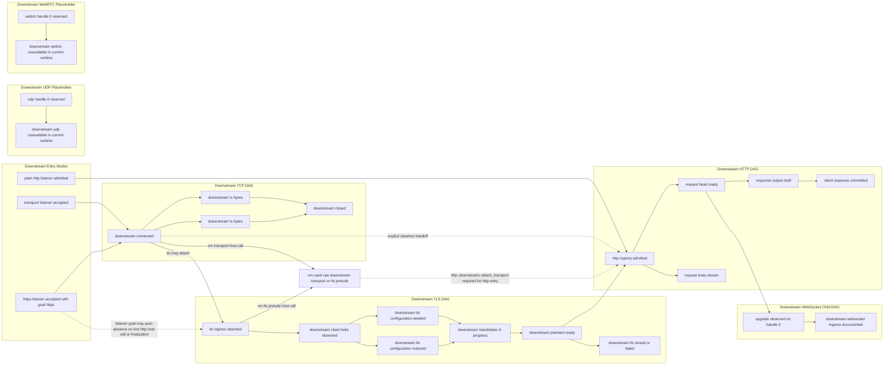
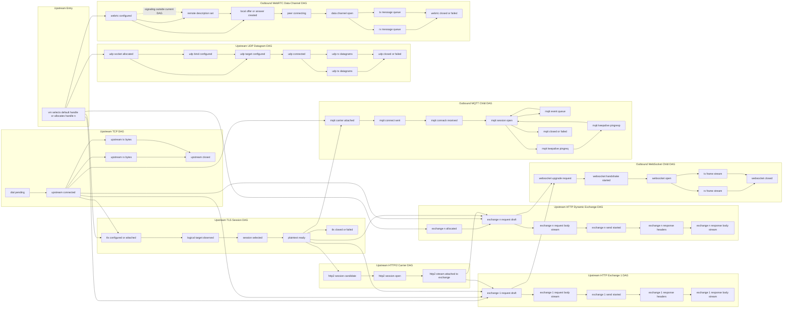

# Full DAG Graphs

This page separates the currently supported protocol model into two conceptual graphs:

- downstream DAGs on the client-facing side
- upstream and exchange DAGs that the runtime may allocate or advance while serving a request

Notes:

- `exchange 1` is the reserved default upstream HTTP exchange.
- `exchange n` represents additional outbound exchanges allocated with `http::exchange::new()`.
- `udp socket 1` is the reserved default upstream UDP handle; `udp socket n` represents additional outbound sockets allocated with `udp::socket::new()`.
- `webrtc connection 1` is the reserved default upstream WebRTC handle; `webrtc connection n` represents additional outbound connections allocated with `webrtc::connection::new()`.
- These graphs show the union of currently supported DAG families. `http`, `http2`, `tls`, `websocket`, `mqtt`, and `webrtc` are feature-gated; the default build enables `http`, `tls`, and `websocket`.
- Current HTTP/2 support lives under the generic HTTP exchange layer. The VM still uses `http::exchange::*`; feature `http2` owns upstream `h2` session reuse explicitly and tracks downstream HTTP/2 sessions in the data-plane server.
- HTTP/2 now has declared internal `session` and `stream` goals, explicit stream carrier refs attached to exchanges, and GOAWAY/reset frontier tracking. It is still an internal carrier DAG rather than a separate VM-visible `http2::*` ABI.
- Internally, carrier-specific policy is now split into `src/abi_impl/http1/` and `src/abi_impl/http2/`, while the generic exchange state remains under `src/abi_impl/http/`.
- VM host calls, request execution, graph resolution, and proxy byte-stream wiring are runtime control layers, not protocol goals. They are intentionally omitted from the graphs below.
- Downstream listener goals are shown below because they now affect which forward edges are legal. The HTTP proxy HTTPS listener begins as downstream TCP with goal `https`; a plain HTTP listener still enters directly at downstream HTTP ingress.
- An untouched downstream HTTPS listener may auto-advance through `tcp -> tls -> http` on first HTTP-scoped host-call entry or during finalization. Once VM code uses raw downstream transport or TLS prelude state, that automatic edge is blocked and `http::downstream::attach_transport()` becomes the explicit bridge into HTTP.
- In that explicit downstream TLS-prelude path, `tls::session::from_socket(...)` first observes `ClientHello`, then the TLS DAG branches to either `configuration needed` or `configuration restored`. `tls::session::needs_configuration(...)` exposes that state to VM code before `tls::session::handshake(...)`.
- There is no symmetric upstream listener-goal layer. Upstream DAGs still begin from VM-selected handles, explicit targets, and connect/send/handshake demand. The adjacent upstream refinement is that TLS sessions now observe the logical target as part of the TLS session DAG, even when the underlying transport was attached first.
- UDP datagrams and WebRTC data-channel messages do not currently flow through `proxy::pipe` or `proxy::forward`; they remain sibling message-oriented DAGs.
- MQTT delivery queues are session-level events above TCP/TLS today; they are not adapted into `proxy::pipe` or `proxy::forward`.
- These graphs are intentionally conceptual. They show ingress and egress connections between DAGs, not every internal transition implemented by each subsystem.

## Downstream Graph

## Upstream And Exchange Graph

## Downstream Versus Upstream

- Downstream may begin from runtime listener policy: plain HTTP enters directly at HTTP ingress, while HTTPS begins as transport plus goal `https` and may auto-advance into TLS and HTTP.
- Upstream has no symmetric listener policy. The VM creates demand by selecting handles, setting targets, and forcing connect, handshake, or send progression.
- MQTT currently exists only on the upstream side. The child DAG attaches to `tcp.connected` or `tls.plaintext ready`; downstream broker-facing listener admission is still a later milestone.
- Downstream auto-promotion is revoked once the VM touches raw downstream transport or TLS prelude state; upstream progression remains explicit and per-handle.
- Downstream DAG instances are tied to the already-admitted client-facing connection. Upstream DAG instances are created or reused on demand and may share carrier state such as upstream TLS or HTTP/2 sessions across exchanges.
